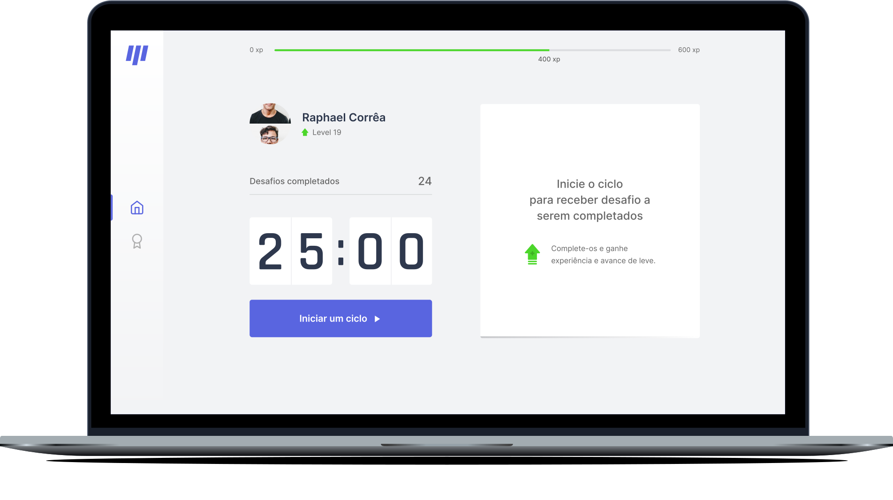

<h1 align="center">
  
  <a href="http://moveit-bice-chi.vercel.app/">Move.it</a>
</h1>
<!-- 
  Technologies OK,
  Preview OK,
  Getting started OK,
  Project OK,
  License Ok OK
-->

O <a href="http://moveit-bice-chi.vercel.app/">Move.it</a> é um pomodoro gameficado que o desafia a cada fim de ciclo de trabalho, a fim de sempre lembrá-lo de se exercitar

## :toolbox: Tecnologias

-  Typescript
-  ReactJS
-  ContextAPI
-  NextJS
-  CSS Modules

## :desktop_computer: Versão online

[Link para projeto](http://moveit-bice-chi.vercel.app/)

## :test_tube: Testando localmente

```sh
# Clone o projeto
git clone https://github.com/raphaeldevs/nlw4-moveit.git

# Acesse a pasta
cd nlw4-moveit

# Instale as dependências
yarn # ou npm i

# Inicie o projeto localmente
yarn dev # ou npm run dev

# Abra o navegador e acesse localhost:3000
```

## 📝 License

Esse projeto está sob a licença MIT. Veja o arquivo de [LICENSE](LICENSE.md) para mais detalhes.

---
